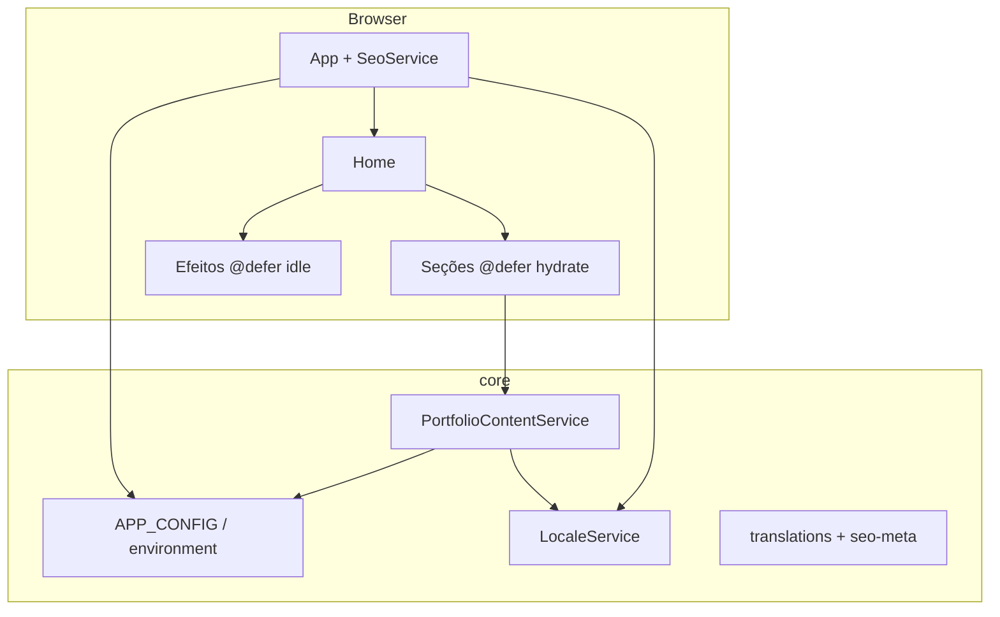

# Portfolio Dev Fullstack

Portfólio pessoal de **Willian Robert Scabora** — site one-page em **Angular 21** com **SSR/prerender**, **Tailwind CSS**, **Signals** (change detection zoneless) e conteúdo bilíngue (PT/EN).

**Site:** [willianscabora.dev](https://willianscabora.dev) · **Repositório:** [github.com/WillianWRS/portfolio-dev-fullstack](https://github.com/WillianWRS/portfolio-dev-fullstack)

[](https://github.com/WillianWRS/portfolio-dev-fullstack/actions/workflows/ci.yml)

## Sobre o projeto

Aplicação pensada como **vitrine técnica**: arquitetura moderna em Angular, performance (hidratação incremental, bundle enxuto), acessibilidade, SEO localizado e pipeline de qualidade no CI.

O conteúdo vive em arquivos TypeScript em `src/app/core/content/` e é servido pelo `PortfolioContentService` com reatividade ao idioma (PT/EN). Projetos em destaque (Habit Builder, Project Math, Profissionais), experiência profissional e depoimentos já estão publicados; slots vazios permanecem reservados para futuras entradas.

### Seções do site

| Seção | Descrição |
|-------|-----------|
| Perfil | Hero com foto progressiva, CTAs e destaques |
| Projetos | Carrossel mobile, vitrine com case study e links live/GitHub |
| Experiência | Timeline (desktop) e cards full-width (mobile) |
| Stacks | Tecnologias agrupadas por área |
| Depoimentos | Cards com citações e contexto |
| Contato | E-mail, WhatsApp, calendário e redes |

### Destaques técnicos

- **Angular 21** — standalone, `OnPush`, `inject()`, signal queries (`viewChild`)
- **Zoneless** — `provideZonelessChangeDetection()` e estado com signals/computed
- **SSR + prerender** — HTML estático no build; hidratação incremental com `@defer (hydrate on viewport)`
- **i18n** — `LocaleService` + traduções; `SeoService` sincroniza title, meta, OG/Twitter e JSON-LD
- **Imagens progressivas** — `ProgressiveImage` + assets críticos em `critical-assets.config.ts` (wall, foto, projetos)
- **Efeitos** — partículas e fundo carregados com `@defer (on idle)`; coordenação via `EffectsCoordinatorService`
- **UI** — tema visual fixo (`color-scheme`) independente do tema do dispositivo; nav flutuante com indicador de hover sincronizado ao scroll
- **Qualidade** — Vitest (cobertura no CI), Playwright, axe (a11y), ESLint + Prettier
- **Deploy** — artefato estático em `dist/.../browser` para **Firebase Hosting** (ver [ADR 002](docs/adr/002-prerender-firebase.md))

## Stack

| Área | Tecnologias |
|------|-------------|
| Framework | Angular 21, Angular SSR |
| Estilo | Tailwind CSS 3, SCSS por componente, variáveis CSS (`--color-surface-*`) |
| Runtime (SSR opcional) | Express 5, compression |
| Testes | Vitest, Playwright, @axe-core/playwright |
| Tooling | ESLint (angular-eslint), Prettier, TypeScript 5.9 strict, Sharp (otimização de imagens) |

## Pré-requisitos

- **Node.js 22** (mesma versão do [CI](.github/workflows/ci.yml))
- npm 10+

## Como rodar localmente

```bash
git clone https://github.com/WillianWRS/portfolio-dev-fullstack.git
cd portfolio-dev-fullstack
npm ci
npm start
```

Abra [http://localhost:4200](http://localhost:4200).

> O `ng serve` usa `hmr: false` de propósito para que os blocos `@defer` façam lazy load real também em desenvolvimento.

### Build e preview de produção

```bash
npm run build
# Artefato estático (Firebase / CDN):
#   dist/portfolio-dev-fullstack/browser

# Servidor SSR (opcional, após o build):
npm run serve:ssr:portfolio-dev-fullstack
```

### Assets estáticos

```bash
# Ícones das stacks (public/icons/stacks/)
npm run icons:sync

# WebP de preview (LQ) para wall e imagens de projetos
npm run images:optimize
```

Após trocar imagens em `public/` (ex.: `new-habit-builder-image.png`, `new-project-math-image.png`), rode `npm run images:optimize` para regenerar as versões LQ usadas no carregamento progressivo.

## Scripts

| Comando | Descrição |
|---------|-----------|
| `npm start` | Dev server |
| `npm run build` | Build de produção com SSR/prerender |
| `npm test` | Testes unitários (Vitest) |
| `npm run test:ci` | Testes + cobertura + thresholds (CI) |
| `npm run e2e` | E2E e acessibilidade (Playwright + axe) |
| `npm run e2e:ci` | E2E no CI (servidor estático) |
| `npm run lint` | ESLint (TS + templates + a11y) |
| `npm run format` | Prettier (escrever) |
| `npm run format:check` | Prettier (verificar) |
| `npm run icons:sync` | Sincronizar ícones de stack |
| `npm run images:optimize` | Gerar WebP otimizados e previews LQ |

## Estrutura do código

```
src/app/
├── core/
│   ├── config/          # APP_CONFIG, critical-assets
│   ├── content/         # Dados estáticos: projetos, experiência, stacks…
│   ├── i18n/            # Traduções UI + metadados SEO
│   ├── models/
│   ├── services/        # Locale, conteúdo, SEO, clipboard, efeitos…
│   └── effects/         # Partículas e config de efeitos
├── features/home/       # Página única e seções
└── shared/ui/           # Componentes reutilizáveis (chips, ícones, imagem progressiva…)

docs/adr/                # Architecture Decision Records
e2e/                     # Playwright + axe
public/                  # Assets, robots.txt, sitemap, manifest
scripts/                 # sync-stack-icons, optimize-images
```

### Path aliases

`@core/*`, `@shared/*`, `@features/*` — definidos em `tsconfig.json`.

## Arquitetura



| Camada | Responsabilidade |
|--------|------------------|
| `core/config` | Identidade e URLs por ambiente (`APP_CONFIG`) |
| `core/content` | Fonte única de dados do portfólio |
| `core/i18n` | PT/EN para UI e SEO |
| `core/services` | Locale, conteúdo reativo, SEO, efeitos |
| `features/home` | Seções, header/footer, partículas |
| `shared/ui` | UI compartilhada |

Decisões documentadas em [`docs/adr/`](docs/adr/):

| ADR | Tema |
|-----|------|
| [001](docs/adr/001-zoneless-signals.md) | Zoneless + signals |
| [002](docs/adr/002-prerender-firebase.md) | Prerender e Firebase Hosting |
| [003](docs/adr/003-incremental-hydration.md) | Hidratação incremental (`@defer`) |

## Configuração por ambiente

Edite:

- `src/environments/environment.ts` — desenvolvimento
- `src/environments/environment.prod.ts` — produção (`fileReplacements` no build)

Nome, e-mail, URLs de CV, calendário e repositório GitHub vêm de `appConfig` e são injetados via token `APP_CONFIG` em `app.config.ts`.

**Não commite** secrets (tokens Firebase, API keys). O repositório não depende de `.env` para rodar localmente. O cache local do Firebase CLI (`.firebase/`) está no `.gitignore`.

## Deploy (Firebase Hosting)

```bash
npm run build
firebase deploy --only hosting
```

Saída esperada: `dist/portfolio-dev-fullstack/browser` (configurado em `firebase.json`).

Projeto Firebase: `portfolio-dev-e5dfe` · domínio customizado: `willianscabora.dev`.

## Qualidade e CI

Pipeline em [`.github/workflows/ci.yml`](.github/workflows/ci.yml):

1. `npm run lint`
2. `npm run test:ci` (cobertura com thresholds)
3. `npm run build`
4. `npm run e2e:ci` (Playwright + axe)

- TypeScript e templates em modo **strict**
- ESLint: Angular, `consistent-type-imports`, regras de acessibilidade em templates
- `public/robots.txt`, `sitemap.xml`, `manifest.webmanifest`

## Editar conteúdo do site

| Seção | Arquivo |
|-------|---------|
| Perfil (nome, links) | `environment*.ts` + `core/content/profile.content.ts` |
| Experiência | `core/content/experience.content.ts` |
| Projetos | `core/content/projects.content.ts` |
| Stacks | `core/content/stacks.content.ts` |
| Depoimentos | `core/content/testimonials.content.ts` |
| Redes sociais | `core/content/social.content.ts` |
| Textos de UI | `core/i18n/translations.ts` |
| Imagens críticas / LQ | `core/config/critical-assets.config.ts` + `public/` |

Após alterar stacks listadas nos projetos, rode `npm run icons:sync`. Após trocar imagens de projeto ou wall, rode `npm run images:optimize`.

## Roadmap (resumo)

- [x] Deploy em produção ([willianscabora.dev](https://willianscabora.dev))
- [x] Projetos vitrine com links live (Habit Builder, Project Math, Profissionais)
- [x] Experiência profissional publicada
- [ ] Preencher slots vazios de projetos e depoimentos
- [ ] Deploy contínuo via CI (hoje o deploy é manual com `firebase deploy`)

## Licença

Código do portfólio — uso e cópia conforme política do autor. Projetos e marcas citados nos conteúdos pertencem aos respectivos titulares.

---

Desenvolvido por **Willian Robert Scabora**.
