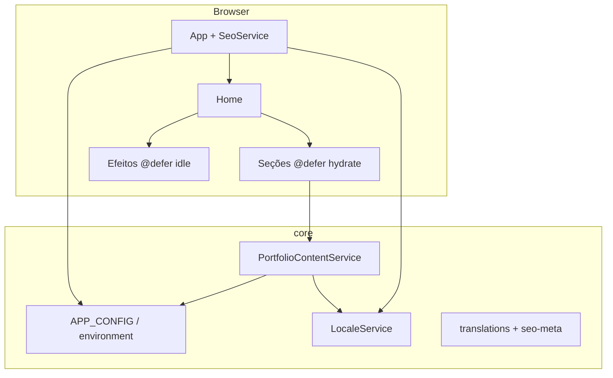

# Portfolio Dev Fullstack

Portfólio pessoal em **Angular 21** com **SSR/prerender**, **Tailwind CSS** e **Signals** (zoneless).

## Arquitetura



| Camada | Responsabilidade |
|--------|------------------|
| `core/config` | `APP_CONFIG` — URLs e identidade por ambiente |
| `core/content` | Dados estáticos (projetos, experiência, stacks) |
| `core/i18n` | Traduções UI + metadados SEO |
| `core/services` | Locale, conteúdo reativo, SEO, clipboard, efeitos |
| `features/home` | Página única, seções e partículas |
| `shared/ui` | Componentes reutilizáveis |

Decisões registradas em [`docs/adr/`](docs/adr/).

## Scripts

| Comando | Descrição |
|---------|-----------|
| `npm start` | Servidor de desenvolvimento (`hmr: false` — `@defer` com lazy load real) |
| `npm run build` | Build de produção com SSR/prerender |
| `npm test` | Testes unitários (Vitest) |
| `npm run test:ci` | Testes + cobertura + thresholds (CI) |
| `npm run e2e` | Testes e2e e acessibilidade (Playwright + axe) |
| `npm run lint` | ESLint (TypeScript + templates + a11y) |
| `npm run format` | Prettier (formatar) |
| `npm run format:check` | Prettier (verificar) |
| `npm run icons:sync` | Baixa ícones de stack para `public/icons/stacks/` |

## Qualidade

- TypeScript e templates em modo **strict** (`noUnusedLocals`, `noUnusedParameters`)
- ESLint com regras Angular + `consistent-type-imports` + acessibilidade em templates
- Prettier integrado via `eslint-config-prettier`
- CI: lint → testes com cobertura → build → e2e + axe
- SEO dinâmico (`SeoService`) sincronizado com `LocaleService`
- `robots.txt`, `sitemap.xml` e `manifest.webmanifest` em `public/`

## SSR / Deploy

Alvo principal: **prerender estático no Firebase Hosting**. Ver [ADR 002](docs/adr/002-prerender-firebase.md).

```bash
npm run build
# Deploy: dist/portfolio-dev-fullstack/browser

# SSR dinâmico (opcional):
npm run serve:ssr:portfolio-dev-fullstack
```

## Configuração por ambiente

Edite `src/environments/environment.ts` (dev) e `environment.prod.ts` (produção). Valores expostos via token `APP_CONFIG` em `app.config.ts`.
