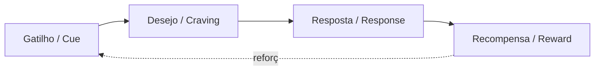
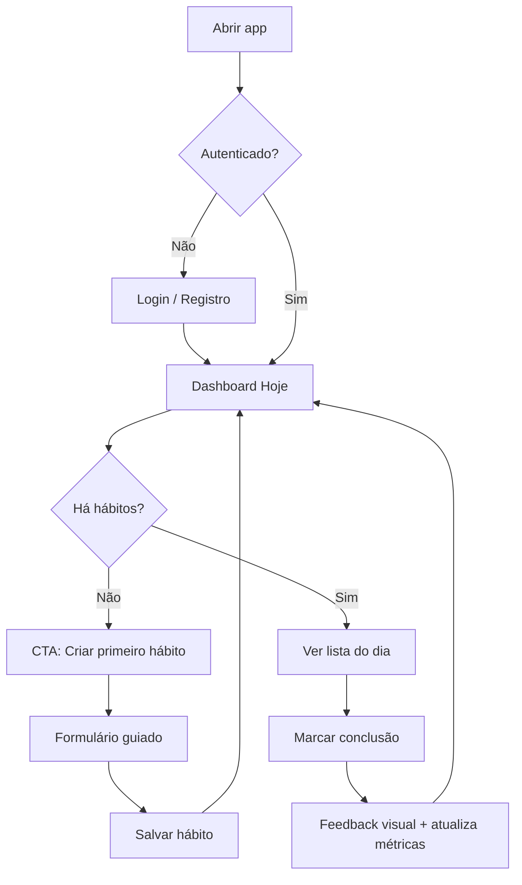
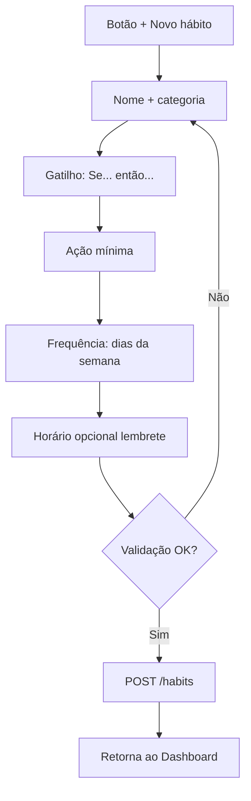
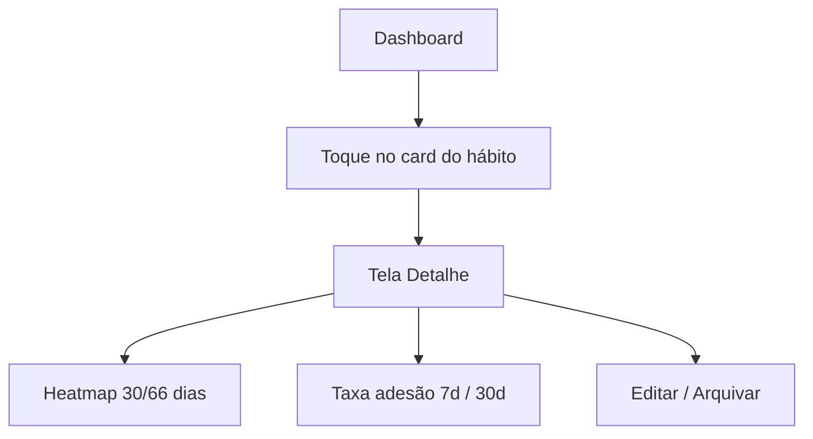
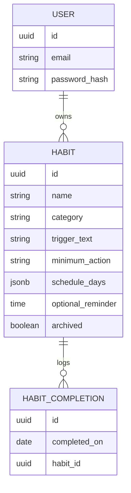

# Habit Builder — Relatório de Descoberta e Planejamento

**Autor do relatório:** assistente de planejamento (sessão com Willian Robert Scabora)  
**Data:** junho de 2026  
**Contexto:** segundo projeto vitrine do portfólio (`portfolio-dev-fullstack`), após **Profissionais**  
**Horizonte estimado:** 1–2 semanas para MVP vitrine · 4–6 semanas para versão “defensável em entrevista”

---

## Sumário

1. [Visão e tese do produto](#1-visão-e-tese-do-produto)
2. [Bases científicas sobre hábitos](#2-bases-científicas-sobre-hábitos)
3. [Case study — problema, solução e impacto](#3-case-study--problema-solução-e-impacto)
4. [Personas e jobs to be done](#4-personas-e-jobs-to-be-done)
5. [Requisitos funcionais e não funcionais](#5-requisitos-funcionais-e-não-funcionais)
6. [Fluxogramas de uso](#6-fluxogramas-de-uso)
7. [Mapa de telas e protótipo visual (wireframes)](#7-mapa-de-telas-e-protótipo-visual-wireframes)
8. [Stack recomendada e arquitetura](#8-stack-recomendada-e-arquitetura)
9. [MVP vs. versões futuras](#9-mvp-vs-versões-futuras)
10. [Métricas, riscos e decisões em aberto](#10-métricas-riscos-e-decisões-em-aberto)
11. [Próximos passos (BMAD leve)](#11-próximos-passos-bmad-leve)
12. [Referências](#12-referências)

---

## 1. Visão e tese do produto

### Uma frase

**Habit Builder** é um gerenciador de hábitos que transforma intenção vaga (“quero ser mais disciplinado”) em **ações mínimas repetíveis**, com **feedback imediato** e **visão de consistência ao longo do tempo** — sem punir o usuário por falhas isoladas.

### Tese de design (derivada da ciência)

| Princípio científico | Decisão de produto |
|----------------------|-------------------|
| Hábitos são automatismos ligados a **contexto**, não só força de vontade | Todo hábito exige **gatilho** (horário, local ou âncora) |
| **Recompensa imediata** consolida comportamento | Feedback visual instantâneo ao marcar (animação, streak, progresso do dia) |
| Metas grandes geram abandono | **Versão mínima viável do hábito** (ex.: 2 min, 1 página, 1 repetição) |
| Consistência > perfeição | **Não resetar todo o histórico** por um dia perdido; mostrar taxa de adesão (%) |
| Identidade muda comportamento de forma duradoura | Opcional: hábito vinculado a identidade (“sou alguém que treina”) |

### Posicionamento no portfólio

- **Categoria:** full stack (ou frontend-heavy se MVP enxuto no backend)
- **Narrativa de entrevista:** problema de retenção comportamental + arquitetura limpa + UX baseada em evidência, não gamificação vazia
- **Slot alvo:** `empty-slot-1` em `projects.content.ts`

---

## 2. Bases científicas sobre hábitos

### 2.1 O loop do hábito (Clear, 2018)

James Clear sintetiza quatro estágios:



**Implicação para o app:** cada hábito cadastrado deve explicitar **quando** (gatilho), **o quê** (resposta mínima) e **o que o usuário ganha** ao marcar (recompensa simbólica — check, streak, barra do dia).

### 2.2 Lei do menor esforço (Fogg, 2009 — *Tiny Habits*)

Comportamento = **Motivação × Habilidade × Prompt** (B=MAP). Quando a habilidade necessária é baixa, o hábito “dispara” mais fácil.

**Implicação:** campo **“versão mínima”** obrigatório no cadastro. Ex.: “Correr 5 km” → mínimo: “Vestir tênis e sair da porta”.

### 2.3 Intenções de implementação (Gollwitzer & Sheeran, 2006)

Formato **“Se X, então Y”** aumenta significativamente a adesão a metas de saúde e organização (meta-análises reportam efeito médio relevante em d ~0.65).

**Implicação:** no formulário de hábito, template:  
> *“Se [gatilho], então [ação mínima]”*

### 2.4 Tempo de formação (Lally et al., 2010)

Em estudo com 96 participantes, tempo médio para automatização **66 dias** (intervalo 18–254). Não são 21 dias como o mito popular diz.

**Implicação:** UI mostra **janelas de 66 dias** ou “fase de formação” em vez de prometer hábito “formado em 3 semanas”.

### 2.5 Consistência e streaks — o lado sombrio

- **Loss aversion** (Kahneman & Tversky): perder um streak dói mais que ganhar um dia positivo — pode gerar abandono total (“efeito o quebrado”).
- Estudos em apps de meditação/hábitos mostram que streaks aumentam engajamento curto prazo, mas **perfeccionismo de sequência** correlaciona com dropout após falha.

**Implicação (diferencial do Habit Builder):**

| Abordagem comum | Abordagem baseada em evidência |
|-----------------|--------------------------------|
| Streak que zera no primeiro erro | **Taxa de adesão 7/30 dias** + streak “suave” (pausa permitida) |
| Culpa por falha | Mensagem neutra: “Recomeçar amanhã no mesmo gatilho” |
| Meta diária rígida | **Dias da semana configuráveis** (ex.: treino 3×/semana) |

### 2.6 Teoria da autodeterminação (Deci & Ryan)

Motivação sustentável vem de **autonomia**, **competência** e **conexão**.

**Implicação:**

- **Autonomia:** usuário define frequência, mínimo e gatilho
- **Competência:** gráficos de evolução, badges discretos por marcos (7, 30, 66 dias)
- **Conexão:** fora do MVP; futuro — accountability partner

### 2.7 Consolidação — pilares do produto

1. **Gatilho explícito** (tempo, âncora ou evento)
2. **Ação mínima** (reduz fricção)
3. **Feedback imediato** (dopamina saudável, não slot machine)
4. **Métrica de consistência** (%), não só streak frágil
5. **Recuperação após falha** (copy e UX sem culpa)

---

## 3. Case study — problema, solução e impacto

### 3.1 Cenário

**Persona:** desenvolvedor em home office, tenta manter hábitos de saúde e estudo. Usa planilha ou Notion por 1–2 semanas, abandona por:

- esquecer o hábito no dia corrido;
- sentir que “já perdeu o dia” e desistir da semana;
- não ver progresso acumulado;
- cadastrar metas grandes demais (“1h de inglês”) sem versão mínima.

### 3.2 Problema (statement)

> Pessoas com intenção clara de construir hábitos **abandonam a prática** por falta de **gatilhos no momento certo**, **ações demasiado ambiciosas** e **feedback punitivo** quando falham um dia — não por falta de informação sobre o que fazer.

### 3.3 Solução proposta — Habit Builder

Aplicação web que permite:

1. Cadastrar hábitos com **gatilho + ação mínima + frequência**
2. Ver **painel do dia** com o que falta marcar hoje
3. Registrar conclusão em **1 toque**
4. Acompanhar **heatmap / taxa de adesão** por hábito
5. Recuperar rotina após falha sem “zerar identidade”

### 3.4 Resultado esperado (mensurável no case do portfólio)

| Métrica | Alvo demonstrável (demo / dogfooding) |
|---------|--------------------------------------|
| Tempo para marcar hábito | < 3 segundos |
| Hábitos ativos por usuário (demo) | 3–7 |
| Taxa de adesão visível | % últimos 7 e 30 dias |
| Onboarding até primeiro hábito | < 2 minutos |
| Cobertura de testes backend | ≥ 70% domínio crítico |

*Nota para o portfólio:* use métricas **reais do seu uso** ou qualitativas honestas (“API < 200ms p95 local”) — nunca inventar “12k usuários”.

### 3.5 Narrativa para entrevista (elevator pitch)

> “Modelei o produto em intenções de implementação e Tiny Habits: cada hábito tem gatilho e versão mínima. O diferencial é tratar consistência como taxa de adesão, não streak frágil — isso reflete literatura sobre abandono após falha. Tecnicamente, API REST com domínio explícito, frontend Angular com estado previsível, e deploy containerizado.”

---

## 4. Personas e jobs to be done

### Persona primária — **Willian (dogfooding / vitrine)**

- **Job:** manter 3–5 hábitos (estudo, treino, leitura) com visibilidade sem planilha
- **Frustração:** ferramentas genéricas ou gamificadas demais
- **Sucesso:** abrir o app 1×/dia, marcar em segundos, ver semana consistente

### Persona secundária — **Recrutador / tech lead**

- **Job:** avaliar competência full stack em 5–10 min
- **Sucesso:** README claro, demo online, código com testes e decisões documentadas

### Persona terciária (futuro) — **Usuário mobile casual**

- Fora do MVP; informa PWA/responsivo desde o dia 1

---

## 5. Requisitos funcionais e não funcionais

### 5.1 Requisitos funcionais (RF)

| ID | Requisito | Prioridade MVP |
|----|-----------|----------------|
| RF-01 | Criar hábito com nome, categoria, frequência (dias da semana) | P0 |
| RF-02 | Definir **ação mínima** e **gatilho** (texto + horário opcional) | P0 |
| RF-03 | Listar hábitos do **dia atual** com status pendente/concluído | P0 |
| RF-04 | Marcar hábito como feito em 1 ação (toggle/check) | P0 |
| RF-05 | Desmarcar conclusão do dia (correção honesta) | P1 |
| RF-06 | Editar e arquivar hábito | P1 |
| RF-07 | Ver detalhe do hábito: calendário/heatmap últimos 30–66 dias | P1 |
| RF-08 | Exibir **taxa de adesão** (7 e 30 dias) por hábito | P1 |
| RF-09 | Exibir streak atual **sem apagar histórico** ao falhar | P2 |
| RF-10 | Autenticação simples (1 usuário ou multi-usuário JWT) | P0* |
| RF-11 | Onboarding em 3 passos (primeiro hábito guiado) | P2 |
| RF-12 | Notificação local / lembrete (browser) | P3 (pós-MVP) |

\* **Decisão:** para vitrine em 1–2 semanas, aceitar **auth mínima** (cadastro/login) ou **usuário único demo** com rota protegida. Recomendação: JWT simples — história melhor em entrevista.

### 5.2 Regras de negócio (RN)

| ID | Regra |
|----|-------|
| RN-01 | Um hábito só pode ser marcado **uma vez por dia** (por usuário) |
| RN-02 | Frequência respeita dias configurados (ex.: seg/qua/sex) |
| RN-03 | Fora do dia configurado, hábito não aparece em “Hoje” |
| RN-04 | Taxa de adesão = dias concluídos ÷ dias esperados no período |
| RN-05 | Arquivar hábito não apaga histórico |
| RN-06 | Ação mínima limitada a 140 caracteres (força simplicidade) |

### 5.3 Requisitos não funcionais (RNF)

| ID | Requisito | Alvo |
|----|-----------|------|
| RNF-01 | Responsivo mobile-first | 360px+ |
| RNF-02 | Acessibilidade | WCAG 2.1 AA nos fluxos principais |
| RNF-03 | Performance | LCP < 2.5s na demo |
| RNF-04 | API | REST documentada (OpenAPI/Swagger) |
| RNF-05 | Testes | Unitários domínio + integração API crítica |
| RNF-06 | Deploy | Docker Compose (API + DB) |
| RNF-07 | i18n | PT-BR no MVP; EN como stretch |
| RNF-08 | Segurança | Senha hash (bcrypt/argon2), JWT expiração |

---

## 6. Fluxogramas de uso

### 6.1 Fluxo principal — primeiro uso



### 6.2 Fluxo — criar hábito



### 6.3 Fluxo — acompanhar progresso



---

## 7. Mapa de telas e protótipo visual (wireframes)

### Resumo: **5 telas no MVP** (+ modais)

| # | Tela | Rota sugerida | Função |
|---|------|---------------|--------|
| 1 | Login / Registro | `/auth` | Entrada única, alternância login/signup |
| 2 | **Hoje** (Dashboard) | `/` ou `/today` | Núcleo do app — marcar hábitos do dia |
| 3 | Lista de hábitos | `/habits` | Todos os hábitos, ativos e arquivados |
| 4 | Criar / Editar hábito | `/habits/new`, `/habits/:id/edit` | Formulário com gatilho e mínimo |
| 5 | Detalhe do hábito | `/habits/:id` | Heatmap, métricas, histórico |

**Modais (não contam como telas):** confirmação arquivar, tooltip “o que é ação mínima?”

---

### Tela 1 — Auth

```
┌─────────────────────────────────────────────┐
│  [logo] Habit Builder                       │
│                                             │
│         ┌─────────────────────┐             │
│         │  E-mail             │             │
│         └─────────────────────┘             │
│         ┌─────────────────────┐             │
│         │  Senha              │             │
│         └─────────────────────┘             │
│         [ Entrar ]  (primário)              │
│         Criar conta · Esqueci senha (P2)    │
└─────────────────────────────────────────────┘
```

**Visual:** fundo escuro (`zinc-950`), card central `max-w-sm`, tipografia display no título — **coerente com portfólio**.

---

### Tela 2 — Hoje (Dashboard) ★ principal

```
┌─────────────────────────────────────────────┐
│ Hoje · qua, 4 jun          [avatar/menu]    │
│ ████████░░  4/5 hábitos                     │
├─────────────────────────────────────────────┤
│ ┌─────────────────────────────────────────┐ │
│ │ ○ Estudar inglês          08:00 · Saúde  │ │
│ │   Mínimo: 1 flashcard                   │ │
│ │                        [ Marcar ✓ ]     │ │
│ └─────────────────────────────────────────┘ │
│ ┌─────────────────────────────────────────┐ │
│ │ ● Treino                  07:00 · Corpo │ │
│ │   Mínimo: 10 min mobilidade   ✓ Feito   │ │
│ └─────────────────────────────────────────┘ │
│ ...                                         │
├─────────────────────────────────────────────┤
│  [ Hoje ]   [ Hábitos ]   [ + ]             │
└─────────────────────────────────────────────┘
```

**Comportamento:**

- Barra superior = progresso do dia (competência, SDT)
- Card pendente: círculo vazio; concluído: check verde + leve animação
- FAB ou tab `+` leva a criar hábito
- Empty state: ilustração mínima + “Se café, então 1 página”

---

### Tela 3 — Lista de hábitos

```
┌─────────────────────────────────────────────┐
│ Meus hábitos                    [ + Novo ]  │
├─────────────────────────────────────────────┤
│ Ativos                                      │
│  • Estudar inglês      86% · 30d   >      │
│  • Treino              72% · 30d   >      │
│ Arquivados (colapsado)                      │
├─────────────────────────────────────────────┤
│  [ Hoje ]   [ Hábitos●]   [ + ]             │
└─────────────────────────────────────────────┘
```

---

### Tela 4 — Criar / Editar hábito

```
┌─────────────────────────────────────────────┐
│ ←  Novo hábito                              │
├─────────────────────────────────────────────┤
│ Nome                                        │
│ [ Estudar inglês________________ ]          │
│ Categoria  [ Saúde ▼ ]                      │
│                                             │
│ 💡 Intenção (Se → Então)                    │
│ Se [ tomar café da manhã_______ ]           │
│ então [ revisar 1 flashcard___ ]  ← mínimo  │
│                                             │
│ Repetir  [S][T][Q][Q][S][S][D]              │
│ Horário opcional [ 08:00 ]                  │
│                                             │
│              [ Salvar hábito ]              │
└─────────────────────────────────────────────┘
```

**Microcopy científico:** link “Por que ação mínima?” abre modal citando Fogg.

---

### Tela 5 — Detalhe do hábito

```
┌─────────────────────────────────────────────┐
│ ←  Estudar inglês              [ Editar ]   │
│ Adesão 30d: 86%    Streak: 5 dias           │
├─────────────────────────────────────────────┤
│     Jun 2026                                │
│  ░░█░███░██░░█░██  (heatmap)               │
│  ░ = perdido  █ = feito  · = não esperado   │
├─────────────────────────────────────────────┤
│ Gatilho: Se café, então 1 flashcard         │
│ Frequência: seg–sex                         │
├─────────────────────────────────────────────┤
│ [ Arquivar hábito ]                         │
└─────────────────────────────────────────────┘
```

---

### Direção visual (design system)

| Token | Sugestão |
|-------|----------|
| Fundo | `zinc-950` / cards `zinc-900` |
| Primário | `emerald-500` (conclusão = crescimento) |
| Secundário | `zinc-400` texto muted |
| Fonte | Plus Jakarta Sans + Fraunces nos títulos (alinhado ao portfólio) |
| Motion | check com scale 0.95→1 · 200ms; respeitar `prefers-reduced-motion` |
| Tom | encorajador, **sem** copy culpabilizante (“Você falhou”) |

---

## 8. Stack recomendada e arquitetura

### 8.1 Recomendação principal (alinhada ao portfólio e à entrevista)

| Camada | Stack | Por quê |
|--------|-------|---------|
| **Frontend** | **Angular 21** (signals, zoneless, OnPush) | Consistência com portfólio; vitrine da sua stack principal |
| **Estilo** | Tailwind CSS 3 | Mesma DX do portfólio |
| **Backend** | **Java 21 + Spring Boot 3** | Par com Profissionais; domínio rico + testes JUnit |
| **Persistência** | **PostgreSQL** | Relacional natural para hábitos, logs diários, usuários |
| **Migrações** | Flyway | Já usado em Profissionais |
| **Auth** | Spring Security + JWT | Stateless, padrão de mercado |
| **API** | REST + OpenAPI (springdoc) | Documentação para recrutador |
| **Testes** | JUnit 5, MockMvc, Vitest (FE) | Cobertura defensável |
| **Deploy** | Docker Compose + opcional Render/Fly/Railway | Demo online para o case |

### 8.2 O que **não** colocar no MVP

| Tecnologia | Motivo |
|------------|--------|
| **Kafka** | Overkill; volume de eventos é baixo |
| Microsserviços | Monólito modular basta |
| MongoDB | Relações usuário–hábito–log são estruturadas |
| React Native | Escopo 1–2 semanas |

### 8.3 Modelo de domínio (simplificado)



### 8.4 Estrutura de repositórios sugerida

```
habit-builder/
├── apps/
│   ├── habit-builder-api/     # Spring Boot
│   └── habit-builder-web/     # Angular
├── docker-compose.yml
├── docs/
│   └── adr/
└── README.md
```

Monorepo opcional; dois repos também válidos (menos vitrine “full stack integrado”).

### 8.5 Endpoints MVP

| Método | Rota | Descrição |
|--------|------|-----------|
| POST | `/auth/register` | Criar conta |
| POST | `/auth/login` | JWT |
| GET | `/habits/today` | Hábitos esperados hoje + status |
| GET | `/habits` | Listar |
| POST | `/habits` | Criar |
| PUT | `/habits/{id}` | Editar |
| PATCH | `/habits/{id}/archive` | Arquivar |
| POST | `/habits/{id}/completions` | Marcar dia |
| DELETE | `/habits/{id}/completions/{date}` | Desmarcar |
| GET | `/habits/{id}/stats` | Adesão, heatmap data |

---

## 9. MVP vs. versões futuras

### MVP (1–2 semanas) — “vitrine honesta”

- [ ] Auth JWT
- [ ] CRUD hábito com gatilho + mínimo + frequência
- [ ] Dashboard Hoje + marcar/desmarcar
- [ ] Detalhe com heatmap simples + % 7/30 dias
- [ ] Docker Compose
- [ ] README + screenshots
- [ ] Entrada no portfólio

### V1.1 (semana 3–4)

- [ ] Onboarding guiado
- [ ] Lembrete browser (Notification API)
- [ ] i18n EN
- [ ] PWA offline read-only

### V2 (produto real)

- [ ] Streak “com pausa” configurável
- [ ] Export CSV
- [ ] Compartilhar progresso
- [ ] App mobile

---

## 10. Métricas, riscos e decisões em aberto

### KPIs do projeto (dogfooding)

- Dias consecutivos usando o próprio app
- Média de hábitos marcados/dia esperado
- Tempo de sessão < 1 min (bom sinal para hábito app)

### Riscos

| Risco | Mitigação |
|-------|-----------|
| Escopo estourar 2 semanas | Travar MVP nos RF P0/P1 |
| Perfeccionismo UI | Reusar design tokens do portfólio |
| Heatmap complexo | Biblioteca leve ou CSS grid simples |
| Auth atrasar MVP | Mock auth só dev — **não** para vitrine pública |

### Decisões para você validar (checklist)

- [ ] **Um repo ou dois?** (recomendo monorepo `habit-builder`)
- [ ] **Multi-usuário** desde o dia 1? (recomendo sim)
- [ ] **Demo pública** com seed de dados fake + sua conta real?
- [ ] Nome final: **Habit Builder** ou variante em PT?
- [ ] Categorias fixas (Saúde, Estudo, Corpo, Mindfulness, Outro)?

---

## 11. Próximos passos (BMAD leve)

| Ordem | Entrega | Tempo |
|-------|---------|-------|
| 1 | Validar este relatório + decisões §10 | 30 min |
| 2 | `docs/bmad/prd.md` — copiar RF/RN deste doc | 1 h |
| 3 | `docs/bmad/stack-decision.md` — ADR da stack §8 | 30 min |
| 4 | `docs/bmad/architecture.md` — ER + endpoints | 1 h |
| 5 | Vertical slice: auth + 1 hábito + marcar hoje | 3–4 dias |
| 6 | Telas restantes + heatmap | 3–4 dias |
| 7 | Deploy + case study portfólio | 1–2 dias |

---

## 12. Referências

1. Clear, J. (2018). *Atomic Habits*. Avery.  
2. Fogg, B.J. (2009). *A Behavior Model for Persuasive Design*. Persuasive Technology.  
3. Gollwitzer, P. M., & Sheeran, P. (2006). Implementation intentions and goal achievement. *Advances in Experimental Social Psychology*.  
4. Lally, P., van Jaarsveld, C., Potts, H., & Wardle, J. (2010). How are habits formed: Modelling habit formation in the real world. *European Journal of Social Psychology*, 40(6), 998–1009.  
5. Deci, E. L., & Ryan, R. M. (2000). Self-determination theory. *Handbook of Self-Determination Research*.  
6. Kahneman, D., & Tversky, A. (1979). Prospect theory. *Econometrica*. (loss aversion)  
7. WOOP / mental contrasting — Oettingen, G. (2014). *Rethinking Positive Thinking*.

---

## Apêndice A — Template de case study (para o portfólio, quando pronto)

**Problema:** …  
**Solução:** …  
**Stack:** Angular 21, Java 21, Spring Boot 3, PostgreSQL, Docker  
**Resultado:** métricas reais ou qualitativas verificáveis  
**Links:** GitHub · Demo · README arquitetura  

---

## Apêndice B — Nome do repositório sugerido

`github.com/WillianWRS/habit-builder`

---

*Este documento é ponto de partida para decisão e BMAD — não substitui validação com usuários reais. Recomenda-se revisar após o primeiro sprint.*
